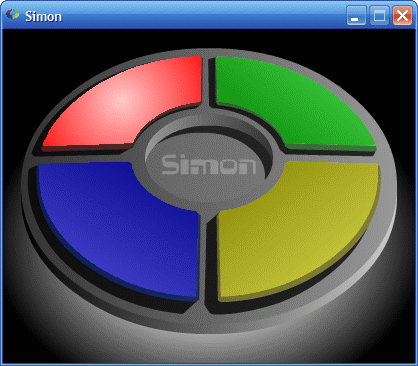



## Simon memory game

### Description

This is my take on the Simon game... using MIDI to make the notes and LaVolpe's RegionShape2 &amp; Carles P.V.'s Fast Gradient to make the buttons. The tone (midi instrument) can be selected by right clicking on the form.
 
### More Info
 

             |
---                |---
**Submitted On**   |2006-06-04 09:55:28
**By**             |[Paul Bahlawan](https://github.com/Planet-Source-Code/PSCIndex/blob/master/ByAuthor/paul-bahlawan.md)
**Level**          |Intermediate
**User Rating**    |5.0 (40 globes from 8 users)
**Compatibility**  |VB 6\.0
**Category**       |[Games](https://github.com/Planet-Source-Code/PSCIndex/blob/master/ByCategory/games__1-38.md)
**World**          |[Visual Basic](https://github.com/Planet-Source-Code/PSCIndex/blob/master/ByWorld/visual-basic.md)
**Archive File**   |[Simon\_memo199861642006\.zip](https://github.com/Planet-Source-Code/paul-bahlawan-simon-memory-game__1-65560/archive/master.zip)

